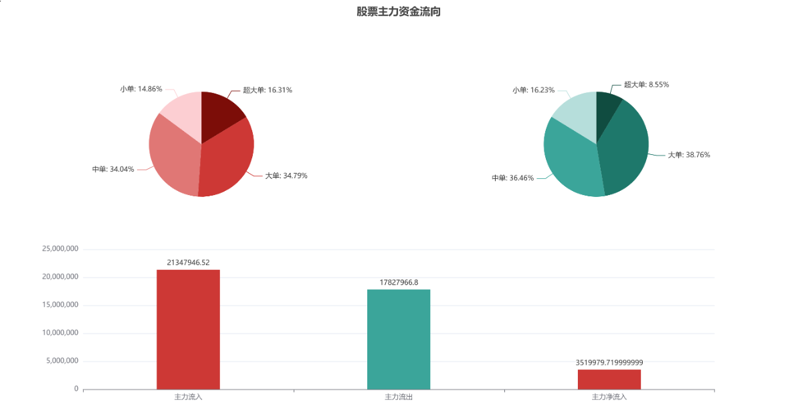

# 股票市场主力资金流向计算

## 项目概述

本项目旨在通过深交所 Level-2 数据（逐笔委托和逐笔成交数据）计算特定股票在给定时间窗口内的主力流入、主力流出和主力净流入等关键指标。

主要特点：
- 数据基于深交所逐笔成交记录，进行清洗、聚合和分析。
- 支持用户自定义时间窗口大小，灵活划分时间段。
- 通过 MapReduce 框架实现高效的分布式计算。

---

## 功能与技术实现

### 功能模块
1. **数据预处理**：
    - 解析并清洗逐笔成交数据。
    - 动态划分时间窗口，支持自定义时间间隔。

2. **主动成交识别**：
    - 基于买卖双方委托索引判断主动买入或主动卖出。

3. **数据聚合与指标计算**：
    - 分类成交量级（超大单、大单、中单、小单）。
    - 计算主力流入、主力流出和主力净流入。

4. **性能优化**：
    - 使用单 Job MapReduce 流程减少作业开销。
    - 基于索引的字段解析优化数据处理效率。

---

### 数据结构

1. **逐笔委托数据**：
    - 包含 `SecurityID`（股票代码）、`Price`（委托价格）、`OrderQty`（委托数量）等字段。
    - 提供辅助分析但非必要。

2. **逐笔成交数据**：
    - 包含 `SecurityID`、`Price`、`TradeQty`（成交数量）、`BidApplSeqNum`（买方索引）、`OfferApplSeqNum`（卖方索引）等字段。
    - 核心数据源，用于所有主力资金指标的计算。

---

## 算法流程

### 总体设计

1. **时间窗口处理**：
    - 动态生成时间窗口，按交易时间划分记录。
    - 特殊时间窗口处理：集合竞价阶段数据划归到闭合的最后窗口。

2. **Mapper 阶段**：
    - 按时间窗口划分交易记录。
    - 过滤无关数据（非目标股票代码、无效成交记录）。

3. **Reducer 阶段**：
    - 按时间窗口聚合数据，分类成交量级。
    - 计算主力流入、主力流出及主力净流入。

### 优化策略
- **单 Job MapReduce 流程**：减少中间数据存储和切换开销。
- **基于索引的字段解析**：替代传统正则解析，提高性能。

---

## 实验结果

### 数据测试
对股票代码从 `000001` 到 `000005` 的数据进行测试，平均处理时间如下：

| 股票代码 | 用时（秒） |
|----------|------------|
| 000001   | 51         |
| 000002   | 51         |
| 000003   | 50         |
| 000004   | 51         |
| 000005   | 51         |

### 数据可视化

---

## 使用方法

1. **数据输入**：
    - 提供深交所逐笔成交数据，格式支持 CSV。
    - 配置目标股票代码和时间窗口大小。

2. **运行环境**：
    - MapReduce 分布式计算框架。
    - 提供 Java 的运行代码支持。

3. **输出结果**：
    - 每个时间窗口内的主力流入、主力流出和主力净流入。
    - 结果以 CSV 格式存储，可用于进一步分析或可视化。
